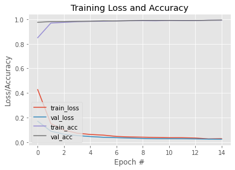
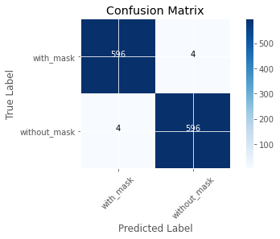
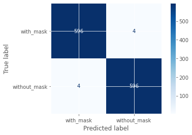

```python
import tensorflow as ts
from tensorflow.keras.preprocessing.image import ImageDataGenerator
from tensorflow.keras.applications import MobileNetV2
from tensorflow.keras.layers import AveragePooling2D
from tensorflow.keras.layers import Dropout
from tensorflow.keras.layers import Flatten
from tensorflow.keras.layers import Dense
from tensorflow.keras.layers import Input
from tensorflow.keras import Model
from tensorflow.keras.optimizers import Adam
from tensorflow.keras.applications.mobilenet_v2 import preprocess_input
from tensorflow.keras.preprocessing.image import img_to_array
from tensorflow.keras.preprocessing.image import load_img
from tensorflow.keras.utils import to_categorical
from sklearn.preprocessing import LabelBinarizer
from sklearn.model_selection import train_test_split
from sklearn.metrics import classification_report
from datetime import datetime
import matplotlib.pyplot as plt
import numpy as np
import os
import pathlib
import session_info
```

    Init Plugin
    Init Graph Optimizer
    Init Kernel


```python
session_info.show()
```


<details>
<summary>Click to view session information</summary>
<pre>
-----
matplotlib          3.5.2
numpy               1.19.5
session_info        1.0.0
sklearn             1.1.1
tensorflow          2.5.0
-----
</pre>
<details>
<summary>Click to view modules imported as dependencies</summary>
<pre>
2f7ece400a652629565c523b34ee61b04afa385c    NA
OpenSSL                                     22.0.0
PIL                                         9.1.1
absl                                        NA
appnope                                     0.1.3
asttokens                                   NA
astunparse                                  1.6.3
backcall                                    0.2.0
beta_ufunc                                  NA
binom_ufunc                                 NA
boto3                                       1.23.10
botocore                                    1.26.10
brotli                                      NA
certifi                                     2022.05.18.1
cffi                                        1.15.0
charset_normalizer                          2.0.12
colorama                                    0.4.4
cryptography                                37.0.2
cycler                                      0.10.0
cython_runtime                              NA
dateutil                                    2.8.2
debugpy                                     1.6.0
decorator                                   5.1.1
defusedxml                                  0.7.1
entrypoints                                 0.4
executing                                   0.8.3
flatbuffers                                 NA
gast                                        NA
google                                      NA
h5py                                        3.1.0
hypergeom_ufunc                             NA
idna                                        3.3
importlib_metadata                          NA
ipykernel                                   6.13.0
ipython_genutils                            0.2.0
jedi                                        0.18.1
jmespath                                    1.0.0
joblib                                      1.1.0
keras_preprocessing                         1.1.2
kiwisolver                                  1.4.2
mpl_toolkits                                NA
nbinom_ufunc                                NA
opt_einsum                                  v3.3.0
packaging                                   21.3
parso                                       0.8.3
pexpect                                     4.8.0
pickleshare                                 0.7.5
pkg_resources                               NA
prompt_toolkit                              3.0.29
psutil                                      5.9.1
ptyprocess                                  0.7.0
pure_eval                                   0.2.2
pydev_ipython                               NA
pydevconsole                                NA
pydevd                                      2.8.0
pydevd_file_utils                           NA
pydevd_plugins                              NA
pydevd_tracing                              NA
pygments                                    2.12.0
pyparsing                                   3.0.9
requests                                    2.27.1
scipy                                       1.8.1
setuptools                                  62.3.2
six                                         1.15.0
socks                                       1.7.1
stack_data                                  0.2.0
tensorboard                                 2.9.0
termcolor                                   1.1.0
threadpoolctl                               3.1.0
tornado                                     6.1
traitlets                                   5.2.2
typing_extensions                           NA
unicodedata2                                NA
urllib3                                     1.26.9
wcwidth                                     0.2.5
wrapt                                       1.12.1
yaml                                        6.0
zipp                                        NA
zmq                                         23.0.0
</pre>
</details> <!-- seems like this ends pre, so might as well be explicit -->
<pre>
-----
IPython             8.4.0
jupyter_client      7.3.1
jupyter_core        4.10.0
notebook            6.4.11
-----
Python 3.9.13 | packaged by conda-forge | (main, May 27 2022, 17:00:33) [Clang 13.0.1 ]
macOS-12.0.1-arm64-arm-64bit
-----
Session information updated at 2022-06-03 13:07
</pre>
</details>


```python
INIT_LR = 1e-4  # Initial Learning Rate
EPOCHS = 15    # How many runs of trainings
BS = 64         # Batch Size of the training
DIRECTORY = r"dataset"
CATEGORIES = ["with_mask", "without_mask"]
data = []   #Image arrays are appended in it
labels = [] #Appends image labels

data_dir = pathlib.Path("dataset")
image_countTotal = len(list(data_dir.glob('*/*')))
image_countMask = len(list(data_dir.glob('with_mask/*')))
image_countWithoutMask = len(list(data_dir.glob('without_mask/*')))
print("Total = ",image_countTotal, ", with_mask = ", image_countMask, ", without_mask = ",image_countWithoutMask )

```

    Total =  6000 , correctly Masked =  0 , incorrectly or without mask =  0


```python
print("[INFO] loading images")
for category in CATEGORIES:
    print(datetime.now()," - Loading "+category+"")
    path = os.path.join(DIRECTORY, category)
    for img in os.listdir(path):
        img_path = os.path.join(path, img)  #specific path of one img
        # LOAD IMAGE AND CONVERT SIZE
        image = load_img(img_path,target_size=(256,256))
        image = img_to_array(image) #KERAS: convert image to array
        image = preprocess_input(image) #MobileNetV2

        # Append Image to data list
        data.append(image)

        # Appends labels to label list
        labels.append(category)
    print(datetime.now()," - Loaded "+category+"")
```

    [INFO] loading images
    2022-06-03 13:07:40.348348  - Loading with_mask


    /Users/leequan/miniforge3/envs/tensorflow/lib/python3.9/site-packages/PIL/Image.py:992: UserWarning: Palette images with Transparency expressed in bytes should be converted to RGBA images
      warnings.warn(


    2022-06-03 13:07:56.075344  - Loaded with_mask
    2022-06-03 13:07:56.075417  - Loading without_mask
    2022-06-03 13:08:07.451287  - Loaded without_mask


```python
# Encoding the labels as 0 and 1
lb = LabelBinarizer()
labels = lb.fit_transform(labels)
labels = to_categorical(labels)

data = np.array(data, dtype="float32")
labels = np.array(labels)
```


```python
(trainX, testX, trainY, testY) = train_test_split(data, labels,test_size = 0.20, stratify=labels, random_state=53)
```


```python
# Construct the training image generator for data augmentation
aug = ImageDataGenerator(
    rotation_range=20,
    zoom_range=0.15,
    width_shift_range=0.2,
    height_shift_range=0.2,
    shear_range=0.15,
    horizontal_flip=True,
    fill_mode="nearest"
    )
```


```python
# load the MobileNetV2 network, ensuring head fc layer sets are left off.
# imagenet is used as the predefined weights for images
baseModel = MobileNetV2(weights="imagenet", include_top=False,
                        input_tensor=Input(shape=(256, 256, 3)))

```

    WARNING:tensorflow:`input_shape` is undefined or non-square, or `rows` is not in [96, 128, 160, 192, 224]. Weights for input shape (224, 224) will be loaded as the default.
    Metal device set to: Apple M1


    2022-06-03 13:08:09.622009: I tensorflow/core/common_runtime/pluggable_device/pluggable_device_factory.cc:305] Could not identify NUMA node of platform GPU ID 0, defaulting to 0. Your kernel may not have been built with NUMA support.
    2022-06-03 13:08:09.622126: I tensorflow/core/common_runtime/pluggable_device/pluggable_device_factory.cc:271] Created TensorFlow device (/job:localhost/replica:0/task:0/device:GPU:0 with 0 MB memory) -> physical PluggableDevice (device: 0, name: METAL, pci bus id: <undefined>)


```python
# construct the head of the model that will be placed on top of the base mmodel
headModel = baseModel.output
headModel = AveragePooling2D(pool_size=(7,7))(headModel)
headModel = Flatten(name="flatten")(headModel)
headModel = Dense(128, activation="relu")(headModel) #non linear, for images
headModel = Dropout(0.3)(headModel) # Dropout rate, careful of overfitting
headModel = Dense(2, activation="softmax")(headModel) #number of categories

```


```python
# place head FC model on top of base model
# This is the ACTUAL model we will train
model = Model(inputs=baseModel.input, outputs=headModel)
```


```python
# loop over all layers in the base model and freeze them so they will not
# be updated during the first training
for layer in baseModel.layers:
    layer.trainable = False

```


```python
# Compile Model
print("[INFO] Compiling model...")
opt = Adam(learning_rate=INIT_LR, decay=INIT_LR / EPOCHS)
model.compile(loss="binary_crossentropy", optimizer=opt,
              metrics=["accuracy"])

```

    [INFO] Compiling model...


```python
# Train the head of the NN
print("[INFO] Training head!")
H = model.fit(
    aug.flow(trainX, trainY, batch_size=BS),
    steps_per_epoch=len(trainX) // BS,
    validation_data=(testX,testY),
    validation_steps=len(testX) // BS,
    epochs=EPOCHS)
```

    [INFO] Training head!


    2022-06-03 13:08:10.841554: I tensorflow/compiler/mlir/mlir_graph_optimization_pass.cc:176] None of the MLIR Optimization Passes are enabled (registered 2)
    2022-06-03 13:08:10.841914: W tensorflow/core/platform/profile_utils/cpu_utils.cc:128] Failed to get CPU frequency: 0 Hz


    Epoch 1/15


    2022-06-03 13:08:11.478739: I tensorflow/core/grappler/optimizers/custom_graph_optimizer_registry.cc:112] Plugin optimizer for device_type GPU is enabled.


    75/75 [==============================] - ETA: 0s - loss: 0.4275 - accuracy: 0.8496

    2022-06-03 13:08:43.598028: I tensorflow/core/grappler/optimizers/custom_graph_optimizer_registry.cc:112] Plugin optimizer for device_type GPU is enabled.


    75/75 [==============================] - 40s 515ms/step - loss: 0.4275 - accuracy: 0.8496 - val_loss: 0.1701 - val_accuracy: 0.9750
    Epoch 2/15
    75/75 [==============================] - 39s 518ms/step - loss: 0.1509 - accuracy: 0.9688 - val_loss: 0.0896 - val_accuracy: 0.9808
    Epoch 3/15
    75/75 [==============================] - 41s 535ms/step - loss: 0.0980 - accuracy: 0.9742 - val_loss: 0.0646 - val_accuracy: 0.9808
    Epoch 4/15
    75/75 [==============================] - 40s 534ms/step - loss: 0.0733 - accuracy: 0.9800 - val_loss: 0.0538 - val_accuracy: 0.9825
    Epoch 5/15
    75/75 [==============================] - 40s 534ms/step - loss: 0.0626 - accuracy: 0.9825 - val_loss: 0.0454 - val_accuracy: 0.9833
    Epoch 6/15
    75/75 [==============================] - 40s 525ms/step - loss: 0.0572 - accuracy: 0.9838 - val_loss: 0.0397 - val_accuracy: 0.9867
    Epoch 7/15
    75/75 [==============================] - 40s 534ms/step - loss: 0.0467 - accuracy: 0.9869 - val_loss: 0.0364 - val_accuracy: 0.9858
    Epoch 8/15
    75/75 [==============================] - 41s 538ms/step - loss: 0.0425 - accuracy: 0.9875 - val_loss: 0.0334 - val_accuracy: 0.9883
    Epoch 9/15
    75/75 [==============================] - 44s 588ms/step - loss: 0.0405 - accuracy: 0.9883 - val_loss: 0.0301 - val_accuracy: 0.9908
    Epoch 10/15
    75/75 [==============================] - 47s 619ms/step - loss: 0.0383 - accuracy: 0.9873 - val_loss: 0.0284 - val_accuracy: 0.9908
    Epoch 11/15
    75/75 [==============================] - 46s 605ms/step - loss: 0.0363 - accuracy: 0.9900 - val_loss: 0.0280 - val_accuracy: 0.9908
    Epoch 12/15
    75/75 [==============================] - 41s 540ms/step - loss: 0.0363 - accuracy: 0.9883 - val_loss: 0.0278 - val_accuracy: 0.9900
    Epoch 13/15
    75/75 [==============================] - 39s 515ms/step - loss: 0.0338 - accuracy: 0.9888 - val_loss: 0.0265 - val_accuracy: 0.9900
    Epoch 14/15
    75/75 [==============================] - 40s 529ms/step - loss: 0.0267 - accuracy: 0.9921 - val_loss: 0.0248 - val_accuracy: 0.9917
    Epoch 15/15
    75/75 [==============================] - 40s 524ms/step - loss: 0.0286 - accuracy: 0.9917 - val_loss: 0.0240 - val_accuracy: 0.9933


```python
# make predictions on the testing set
print("[INFO] evaluating network...")
predIdxs = model.predict(testX, batch_size=BS)

# for each image in the testing set we need to find the index of the label with
# corresponding largest predicted probability
predIdxs = np.argmax(predIdxs, axis=1)

# show a nicely formatted classification report
print(classification_report(testY.argmax(axis=1), predIdxs, 
                            target_names=lb.classes_))


```

    [INFO] evaluating network...


    2022-06-03 13:18:29.399649: I tensorflow/core/grappler/optimizers/custom_graph_optimizer_registry.cc:112] Plugin optimizer for device_type GPU is enabled.


                  precision    recall  f1-score   support
    
       with_mask       0.99      0.99      0.99       600
    without_mask       0.99      0.99      0.99       600
    
        accuracy                           0.99      1200
       macro avg       0.99      0.99      0.99      1200
    weighted avg       0.99      0.99      0.99      1200
    


```python
# Plot training loss and accuracy
N = EPOCHS
plt.style.use("ggplot")
plt.figure()
plt.plot(np.arange(0, N), H.history["loss"], label="train_loss")
plt.plot(np.arange(0, N), H.history["val_loss"], label="val_loss")
plt.plot(np.arange(0, N), H.history["accuracy"], label="train_acc")
plt.plot(np.arange(0, N), H.history["val_accuracy"], label="val_acc")
plt.title("Training Loss and Accuracy")
plt.xlabel("Epoch #")
plt.ylabel("Loss/Accuracy")
plt.legend(loc="lower left")
plt.savefig("plot.png")

plt
```


    <module 'matplotlib.pyplot' from '/Users/leequan/miniforge3/envs/tensorflow/lib/python3.9/site-packages/matplotlib/pyplot.py'>


    

    


```python
print("[INFO] Generating confusion matrix...")
from sklearn.metrics import confusion_matrix, ConfusionMatrixDisplay
import itertools
```

    [INFO] Generating confusion matrix...


```python
cm = confusion_matrix(y_true=testY.argmax(axis=1), y_pred = predIdxs)
```


```python
cm
```


    array([[596,   4],
           [  4, 596]])


```python
# Function to plot confusion matrix, do not import the plot_confusion_matrix from sklearn.metrics because 
# we do not have estimator here.
def plot_confusion_matrix(cm, classes, normalize=False, title="Confusion Matrix", cmap=plt.cm.Blues):
    plt.imshow(cm,interpolation="nearest",cmap=cmap)
    plt.title(title)
    plt.colorbar()
    tick_marks=np.arange(len(classes))
    plt.xticks(tick_marks, classes, rotation=45)
    plt.yticks(tick_marks, classes)
    
    if normalize:
        cm = cm.astype('float') / cm.sum(axis=1)[:, np.newaxis]
        print("Normalised Confusion Matrix")
    else:
        print("Confusion Matrix without Normalization")
        
    print(cm)
    
    thres = cm.max()/2
    for i,j in itertools.product(range(cm.shape[0]),range(cm.shape[1])):
        plt.text(j,i,cm[i,j],horizontalalignment="center", color="white" if cm[i,j] > thres else "black")
        
    plt.tight_layout()
    plt.xlabel("Predicted Label")
    plt.ylabel("True Label")
```


```python
plot_confusion_matrix(cm=cm, classes=CATEGORIES, title="Confusion Matrix" )
plt.savefig("confusion_matrix.png")
```

    Confusion Matrix without Normalization
    [[596   4]
     [  4 596]]


    

    


```python
#Easier way of plotting confusion matrix
disp = ConfusionMatrixDisplay(confusion_matrix=cm, display_labels=CATEGORIES)
disp.plot(cmap=plt.cm.Blues)
```


    <sklearn.metrics._plot.confusion_matrix.ConfusionMatrixDisplay at 0x1106acf70>


    

    


```python
# SERIALIZE model to the disk
print("[INFO] saving mask detector model...")
model.save("../facemask_detector.model", save_format="h5")
```

    [INFO] saving mask detector model...


```python

```
